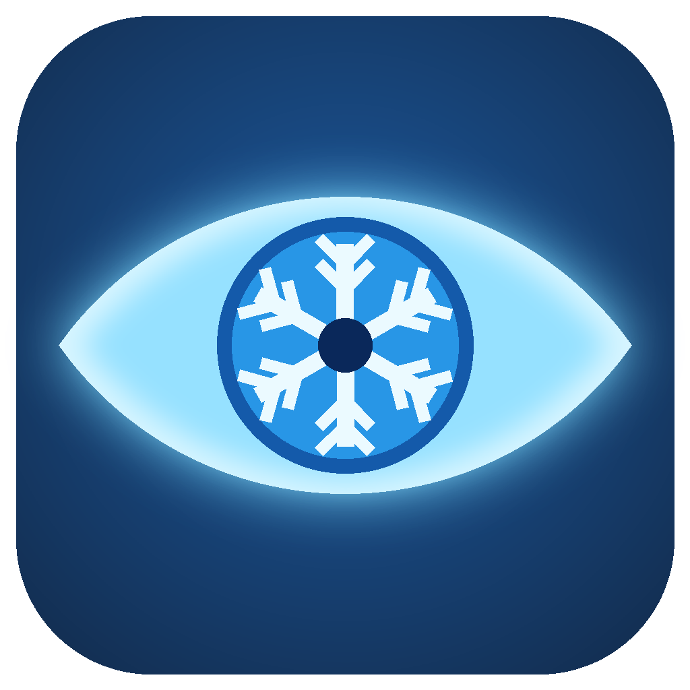

# SkadiTerminal



Dota-2-Helfer für Windows (früher **Gterminal**). Läuft lokal auf dem Gaming-PC –
Bilderkennung, Maus- und Tastatursteuerung brauchen den echten Bildschirm.

## Hotkeys (global, auch im Spiel)

| Taste | Aktion |
|---|---|
| `Ende` | Pick-Makro starten (änderbar unter *Zeiten & Hotkey*) |
| `Pos1` | Enter alle 5 s |
| `Strg + Einfg` | Taste 4 alle 5 s |
| `Backspace` | Alle Makros stoppen |
| `Einfg + Entf` | Steam **und** Discord schließen |
| `Bild↑ + Bild↓` | Spiele schließen |
| `F8` | Punkt bei der Koordinaten-Kalibrierung speichern |

## Pick-Makro (Taste `Ende`)

| Phase | Was passiert |
|---|---|
| **A** | Wartet auf das Helden-Suchfeld (Bild) bzw. nutzt die kalibrierten Koordinaten und klickt 2x |
| **B** | Tippt die Helden der Reihe nach, ENTER, klickt „Auswählen“, wartet auf PLANUNG |
| **C** | Kauft das aktive Item-Set per Rechtsklick (einmal pro Match) |
| **D** | **Doppel-Pick-Check:** Haben du und das Gegnerteam denselben Helden genommen, wird neu gepickt – mit dem nächsten Helden aus deiner Liste |

Phase D erkennt den Doppel-Pick über
1. das optionale Template `skadi_doppelt.png` (Konfiguration → Bild-Templates → Karte 5), oder
2. Suchfeld wieder sichtbar **und** PLANUNG verschwunden.

Prüfdauer einstellbar unter *Zeiten & Hotkey → Prüfdauer* (Standard 60 s),
an/aus über den Button „Doppel-Check“ im Pick-Tab.

## Testen

1. **Erkennung testen** (Tab Konfiguration): prüft alle Templates gegen den aktuellen Bildschirm
   und zeigt die Trefferwerte (ab 0,65 gilt als gefunden).
2. **🧪 Doppel-Pick-Erkennung testen**: startet nur Phase D – ohne zu klicken oder zu tippen.
   Erst den PLANUNG-Bildschirm zeigen, dann zur Heldenauswahl (Suchfeld) wechseln.
   Nach ca. 1–2 s muss „✔ Doppel-Pick ERKANNT“ in der Statuszeile stehen.
   Geht auch ohne Dota: eigene Debug-Screenshots (`debug_*_planung.png`, dann einen mit Heldenauswahl)
   nacheinander im Vollbild bei 100 % öffnen.
3. Normales Spiel (gern Lobby mit Bots): Ablauf A → B → C → D in der Statuszeile verfolgen.

## Wo liegen Templates und Einstellungen?

Im **Google Drive**, nicht neben der EXE – damit jeder PC dieselben Bilder, Presets und Item-Sets hat:

```
<Laufwerk>:\Meine Ablage\_060_Projekte\_010_Aktiv\SkadiTerminal\
    skadi_field.png, skadi_auswahl.png, skadi_planung.png, …   (Templates)
    skadi_config.json                                           (Presets, Item-Sets, Zeiten)
```

Das Laufwerk (meist `G:`) sucht SkadiTerminal selbst. Die EXE kann irgendwo liegen.
Beim ersten Start holt es fehlende Dateien automatisch aus `Dota2_Draft_Helfer_Maerz` bzw.
`gterminal26` (aus `gterminal_*` wird `skadi_*`; kopiert, nichts wird gelöscht).

Anderer Ordner gewünscht? Eine Textdatei `skadi_datenordner.txt` mit dem Pfad neben die EXE legen.
Ohne Google Drive wird der Ordner der EXE benutzt.

**Andere Auflösung / anderer PC:** Die Templates werden beim Suchen automatisch skaliert
(getestet von 1680×1050 bis 3840×2400). Die passende Skalierung wird pro Auflösung gelernt;
zurücksetzen über *Konfiguration → Skalierung neu lernen*.

**Templates im Repo:** Bilder im Ordner [`templates/`](templates/) werden in die EXE eingebaut
und auf jedem PC automatisch bereitgestellt – auch ohne Google Drive.

## Bauen

```bat
build.bat
```
Ergebnis: `dist\SkadiTerminal.exe` (Logo ist eingebaut). Am besten nach
`…\_010_Aktiv\SkadiTerminal\` kopieren – dort sucht sie auch der Spielstart-Wächter.
